# CÁLCULO CONSERVADOR - NETO TOTAL v105.0
**Fecha:** 28 de Enero de 2026  
**Estado:** ✅ Implementado - Pendiente de Deploy

---

## 📌 Concepto

El **Neto Total** (Hero Card Verde Neón) ahora es **100% conservador** y muestra únicamente dinero líquido y disponible. El cashback se trackea por separado como "dinero por caer".

---

## 🎯 Fórmula del Neto Total

```
Neto Total = Honorarios + (Balance Cuentas PST * 0.5)

Donde:
- Honorarios = Ingresos - Gastos del mes
- Balance Cuentas PST = Saldo de cuentas ID 15 e ID 2
- Cashback Aprobado = NO suma (solo tracking)
- Cashback Hold = NO suma (solo tracking)
```

---

## 🔧 Cambios en Backend (`pst_sync_balances.py`)

### Antes (v3.2.1):
```python
total_general = balance_cuentas_total + cashback_aprobado
neto_reparto = total_general / 2
```
**Problema:** El cashback aprobado se sumaba al neto, inflando artificialmente el total.

### Ahora (v3.2.2):
```python
# CÁLCULO CONSERVADOR
total_para_neto = balance_cuentas_total  # SIN cashback
neto_reparto = total_para_neto / 2

# Cashback al 50% (separado, solo tracking)
cashback_aprobado_50 = cashback_aprobado / 2
cashback_retenido_50 = cashback_retenido / 2
```

### Valores Guardados en Supabase:

| Clave | Valor | Uso |
|-------|-------|-----|
| `pst_balance_neto` | 50% de cuentas ID 15+2 | Suma al Neto Total |
| `pst_cashback_aprobado` | Cashback aprobado (100%) | Tracking (frontend aplica 50%) |
| `pst_cashback_hold` | Cashback hold (100%) | Tracking (frontend aplica 50%) |

---

## 🎨 Cambios en Frontend (`webapp/app/dashboard/page.tsx`)

### 1. Hero Card (Verde Neón)

**Desglose visible en mes actual:**
```
┌─────────────────────────────────────┐
│ Neto Total del Mes                  │
│ $X,XXX.XX                           │
├─────────────────────────────────────┤
│ Desglose:                           │
│ • Honorarios: $X,XXX                │
│ • PST Depositado: $X,XXX            │
│   (ID 15 + ID 2 al 50%)             │
└─────────────────────────────────────┘
```

### 2. Bloque "Cashback Stacked" (Nuevo)

**Solo visible en mes actual:**
```
┌─────────────────────────────────────┐
│ ⏱️ Cashback Acumulado (Tracking)    │
│ Dinero por caer • No suma al Neto   │
├─────────────────────────────────────┤
│ Grid 2 columnas:                    │
│ • Aprobado: $XXX (50% aplicado)     │
│ • En Hold: $XXX (50% aplicado)      │
├─────────────────────────────────────┤
│ 💡 Este cashback NO se suma al Neto │
│    Cuando PST deposite, el balance  │
│    subirá automáticamente.          │
└─────────────────────────────────────┘
```

**Colores:**
- **Aprobado:** Verde esmeralda (`emerald-500`)
- **Hold:** Ámbar (`amber-500`)

---

## 📊 Flujo de Traspaso

```mermaid
graph LR
    A[Cashback Hold] -->|PST deposita| B[Cashback Aprobado]
    B -->|PST deposita| C[Cuenta ID 15/2]
    C -->|Sync| D[Neto Total sube automáticamente]
    
    style A fill:#FFA500
    style B fill:#10B981
    style C fill:#FF00FF
    style D fill:#00FF41
```



### Ciclo de Vida:
1. **Hold:** Cashback en espera (tracking ámbar)
2. **Aprobado:** PST aprueba el cashback (tracking verde)
3. **Depositado:** PST deposita en cuentas ID 15/2
4. **Sync:** Backend sincroniza → Neto sube → Cashback baja

---

## 🔍 Ejemplo Práctico

### Escenario:
- **Honorarios del mes:** $5,000 USD
- **Balance Cuenta ID 15:** $2,000 USD
- **Balance Cuenta ID 2:** $3,000 USDT
- **Cashback Aprobado:** $500 USD
- **Cashback Hold:** $300 USD

### Cálculo:

**Backend calcula:**
```python
balance_cuentas_total = 2000 + 3000 = 5000
neto_reparto = 5000 / 2 = 2500
```

**Frontend muestra:**
```
Hero Card (Verde Neón):
├─ Neto Total del Mes: $7,500 USD
│  ├─ Honorarios: $5,000
│  └─ PST Depositado: $2,500 (50% de $5,000)

Bloque Cashback Stacked:
├─ Aprobado: $250 USD (50% de $500)
└─ En Hold: $150 USD (50% de $300)

Total Trackeable: $7,900 USD
├─ Neto Líquido: $7,500 ← Se muestra en Hero Card
└─ Cashback Tracking: $400 ← No suma, solo info
```

---

## ✅ Ventajas del Cálculo Conservador

| Ventaja | Descripción |
|---------|-------------|
| 🛡️ **Conservador** | Solo muestra dinero 100% disponible |
| 🔍 **Transparente** | Separación clara entre neto y tracking |
| 🚫 **Sin Duplicación** | El cashback no infla el neto artificialmente |
| 🔄 **Auto-Reconciliación** | Cuando PST deposita, todo se ajusta solo |
| 📊 **Tracking Visual** | Puedes ver cuánto dinero está "por caer" |

---

## 🚀 Deploy

### 1. Backend (Render)
```bash
# El backend se auto-deployea desde GitHub
# Verificar que el deploy esté activo en:
# https://dashboard.render.com/web/srv-XXXXX

# Probar el endpoint:
curl -X POST https://black-infra-api-pure.onrender.com/sync-pst
```

### 2. Frontend (Vercel)
```bash
cd webapp
npx vercel --prod
```

### 3. Verificación

**Paso 1:** Sincronizar PST desde el Dashboard  
**Paso 2:** Verificar que el Hero Card muestre solo cuentas  
**Paso 3:** Confirmar que el bloque "Cashback Stacked" muestre valores separados  

---

## 📝 Archivos Modificados

| Archivo | Cambios | Estado |
|---------|---------|--------|
| `backend/pst_sync_balances.py` | Cálculo conservador del neto | ✅ Modificado |
| `webapp/app/dashboard/page.tsx` | Nuevo bloque Cashback Stacked | ✅ Modificado |
| `CORE_CONTEXT.md` | Documentación v105.0 | ✅ Actualizado |
| `CALCULO_CONSERVADOR_v105.md` | Este documento | ✅ Creado |

---

## 🧪 Testing

### Checklist:
- [ ] Sincronizar PST desde Dashboard
- [ ] Verificar que Neto = Honorarios + PST (50% cuentas)
- [ ] Confirmar que Cashback NO suma al Neto
- [ ] Verificar que bloque "Cashback Stacked" aparece solo en mes actual
- [ ] Probar cambio de mes (bloque debe desaparecer)
- [ ] Verificar logs en Render para confirmar cálculo

---

## 📞 Soporte

En caso de inconsistencias:

1. **Revisar logs de Render:** https://dashboard.render.com/web/srv-XXXXX/logs
2. **Verificar Supabase:** Tabla `configuracion` debe tener:
   - `pst_balance_neto` (50% de cuentas)
   - `pst_cashback_aprobado` (100%)
   - `pst_cashback_hold` (100%)
3. **Re-sincronizar:** Botón "💰 Sincronizar PST.NET" en Dashboard

---

**Estado Final:** ✅ Listo para Deploy  
**Versión Backend:** 3.2.2 (Cálculo Conservador)  
**Versión Frontend:** v105.0 (Compartimentos Estancos + Conservador)
